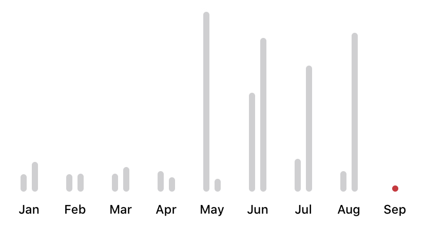

# BarChartKit

UIKit / SwiftUI library for creating Bar Chart similar to chart used in iOS Health app.



## Requirements
- iOS 13.0+ 
- watchOS 6.0+
- macOS 10.15+

## Installation

#### BarChartKit supports [XCFramework](https://developer.apple.com/videos/play/wwdc2019/416/) integration into Xcode project. Just go to [Release page](https://github.com/marekpridal/BarChart/releases), download latest version, drag and drop it into existing Xcode project and you are done 🎉

BarChartKit also supports SwiftPM. You can integrate BarChartKit using SwiftPM directly via Xcode or manually using Package.swift.

### [Xcode](https://developer.apple.com/documentation/xcode/adding_package_dependencies_to_your_app)

To add a package dependency to your Xcode project, select File > Swift Packages > Add Package Dependency and enter its repository URL. You can also navigate to your target’s General pane, and in the “Frameworks, Libraries, and Embedded Content” section, click the + button. In the “Choose frameworks and libraries to add” dialog, select Add Other, and choose Add Package Dependency.

Instead of adding a repository URL, you can search for a package on [GitHub](https://github.com/) or [GitHub Enterprise](https://github.com/enterprise). Add your [GitHub](https://github.com/) or [GitHub Enterprise](https://github.com/enterprise) account in Xcode’s preferences, and a list of package repositories appears as you type. The following screenshot shows the list of repositories for the search term ExamplePackage.

## Usage
```swift
import BarChartKit

let mockBarChartDataSet: BarChartView.DataSet? = BarChartView.DataSet(elements: [
    BarChartView.DataSet.DataElement(date: nil, xLabel: "Jan", bars: [BarChartView.DataSet.DataElement.Bar(value: 20000, color: UIColor.green), BarChartView.DataSet.DataElement.Bar(value: 15000, color: UIColor.blue)]),
    BarChartView.DataSet.DataElement(date: nil, xLabel: "Feb", bars: [BarChartView.DataSet.DataElement.Bar(value: 0, color: UIColor.green)]),
    BarChartView.DataSet.DataElement(date: nil, xLabel: "Mar", bars: [BarChartView.DataSet.DataElement.Bar(value: 10000, color: UIColor.green), BarChartView.DataSet.DataElement.Bar(value: 5000, color: UIColor.blue)]),
    BarChartView.DataSet.DataElement(date: nil, xLabel: "Apr", bars: [BarChartView.DataSet.DataElement.Bar(value: 20000, color: UIColor.green), BarChartView.DataSet.DataElement.Bar(value: 15000, color: UIColor.blue)]),
    BarChartView.DataSet.DataElement(date: nil, xLabel: "May", bars: [BarChartView.DataSet.DataElement.Bar(value: 32000, color: UIColor.green), BarChartView.DataSet.DataElement.Bar(value: 15000, color: UIColor.blue)]),
    BarChartView.DataSet.DataElement(date: nil, xLabel: "Jun", bars: [BarChartView.DataSet.DataElement.Bar(value: 20000, color: UIColor.green)]),
    BarChartView.DataSet.DataElement(date: nil, xLabel: "Jul", bars: [BarChartView.DataSet.DataElement.Bar(value: 20000, color: UIColor.green), BarChartView.DataSet.DataElement.Bar(value: 0.5555, color: UIColor.blue)])
    ], selectionColor: UIColor.yellow)


let barChart = BarChartView()
barChart.dataSet = mockBarChartDataSet

view.addSubview(barChart)
barChart.translatesAutoresizingMaskIntoConstraints = false
NSLayoutConstraint.activate([
    barChart.leadingAnchor.constraint(equalTo: view.leadingAnchor),
    barChart.trailingAnchor.constraint(equalTo: view.trailingAnchor),
    barChart.topAnchor.constraint(equalTo: view.topAnchor),
    barChart.bottomAnchor.constraint(equalTo: view.bottomAnchor)
])
```
